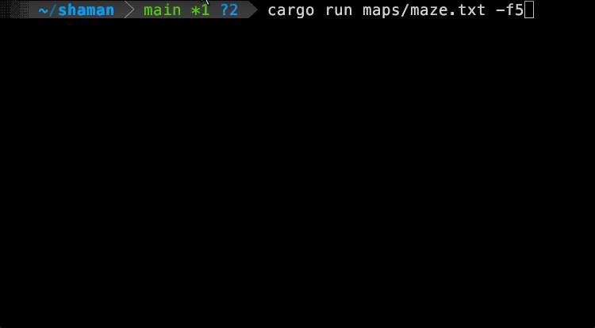
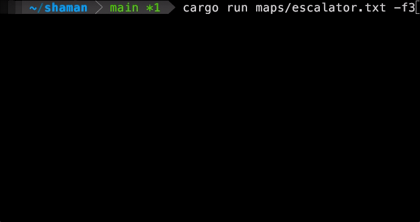
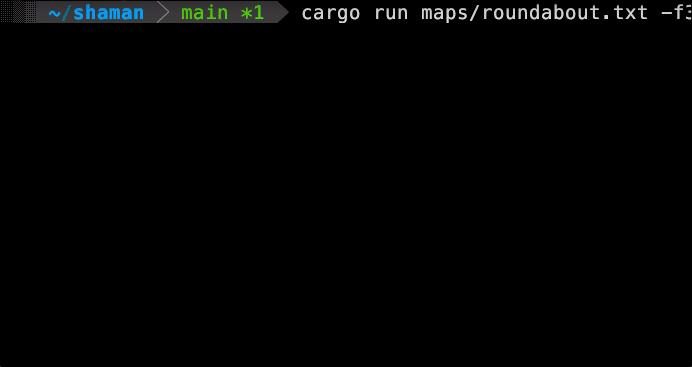

# shaman

Collision Based Search playground for experimenting with multi-agent path finding algorithms

```console
cargo run maps/narrow.txt
```

| Maze | Escalator | Roundabout |
|:-:|:-:|:-:|
|  |  |  |

## Maps

To define you own experiment create a text file and "draw" it inside

* ` ` (space): a free cell where robots can move
* `#` or `█`: an obstacle, where robots cannot move
* `A` to `D`: robot's starting locations
* `a` to `d`: corresponding robot goals
* `ⓐ` to `ⓓ`: set the corresponding robot's goal to the cell below. Useful if on this cell is already another robot right now
