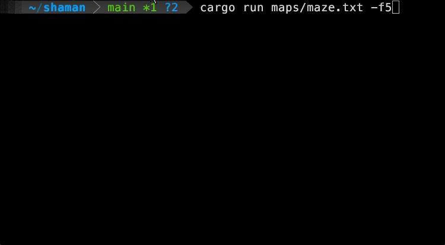
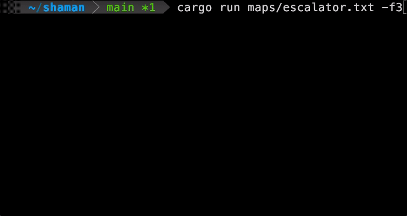
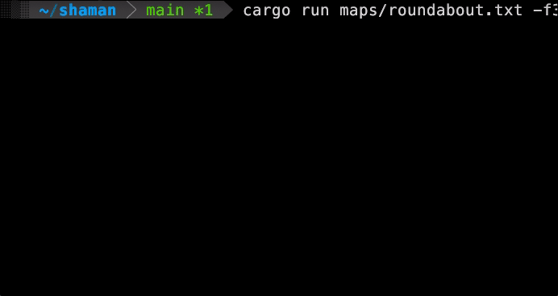

# shaman

Collision Based Search playground for experimenting with multi-agent path finding algorithms

```console
cargo run maps/maze.txt
```

| Maze | Escalator | Roundabout |
|:-:|:-:|:-:|
|  |  |  |

## Maps

To define you own experiment create a text file and "draw" it inside

* ` ` (space): a free cell where robots can move
* `#` or `█`: an obstacle, where robots cannot move
* `A` to `D`: robot's starting locations
* `a` to `d`: corresponding robot goals
* any other character is considered a _label_ (see [MAPD](#mapd-go-there-and-come-back))

## MAPF: "Go there"

This is the default mode when you just draw the map. Here the robot will do "multi-agent path finding" each to one specific goal:

```
#############
#A#a        #
# ######### #
#   #       #
# # # #######
# # #       #
# # ####### #
# #b#   #   #
# ### # # # #
#     # # # #
####### # # #
#         #B#
#############
```

## MAPD: "Go there and come back"

If you prefix the map with a route definition block, you can create routes to multiple goals for each robot. Here each robot will
plan routes to the labels you defined in order:

```
A=[1,2,3,4]
B=[4,2,3,1]
C=[3,4,1,2]
D=[3,1,4,3]
#          #
############
# 1 #### 3 #
#          #
#  C AB D  #
#          #
# 2 #### 4 #
############
```

## RHCR

Based on the paper [Lifelong Multi-Agent Path Finding in Large-Scale Warehouses](https://cdn.aaai.org/ojs/17344/17344-13-20838-1-2-20210518.pdf)
you can configure a rolling horizon collision resolution algorithm by tuning the `h` & `w` parameters:

* `w`: The time window, in which no collisions are allowed.
* `h`: The replanning period in time steps. Should be less or equal to `w`
